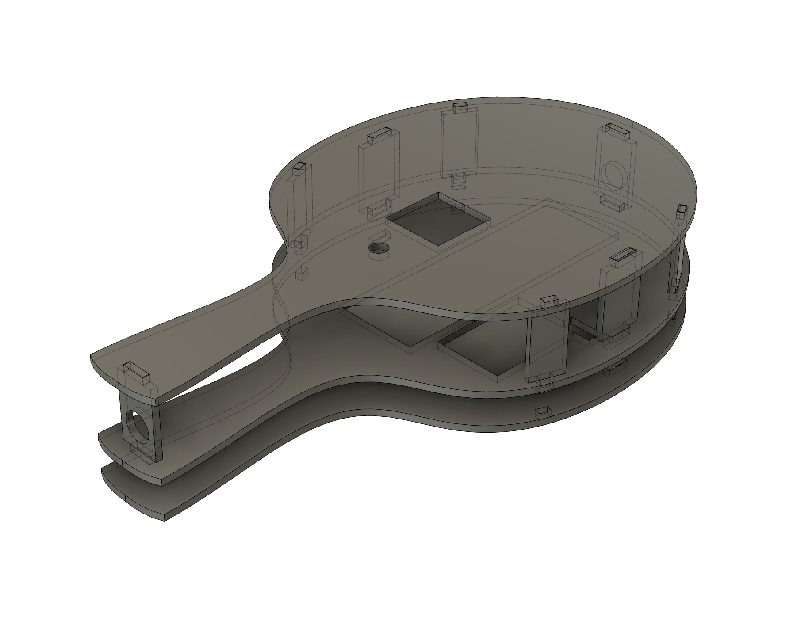
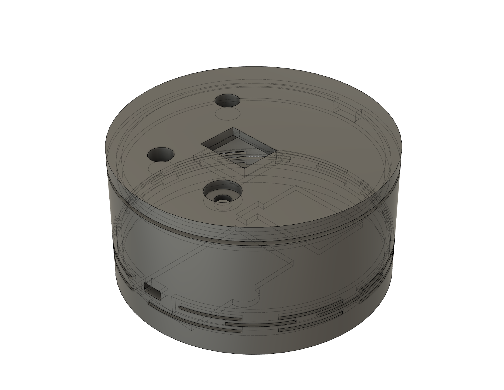

# **PANG! — A Reaction-Based Handheld Game**

## **1. Overview**

**PANG!** is a fast-paced reaction game inspired by 90s handheld toys such as **Bop It**.  
The name **“PANG!”** comes from the sharp popping sound that represents a sudden, reflex-driven moment—just like the quick actions players must perform in the game.

Players choose from three difficulty levels and must respond to directional commands—**up, down, left, right**—within a strict time limit. Each successful action advances the game to the next level, while a missed or incorrect move ends the run instantly.

The game is powered by a **Xiao ESP32-C3**, using a combination of motion sensing, manual input, LED animations, buzzer audio cues, and an OLED display. A LiPo battery and custom 3D-printed enclosure make the device fully portable.

---

## **2. How the Game Works**

### **1. Game Start**
- Upon powering on, the NeoPixel LEDs play a playful startup animation accompanied by a buzzer jingle and a white breathing-light effect.
- The ADXL345 accelerometer performs **initial calibration**.
- The player uses the **rotary encoder** to select a difficulty mode:  
  **Easy / Normal / Hard** — each determines the allowed reaction time.
- Pressing the encoder button begins the game.

---

### **2. Gameplay Loop**

#### **Actions and Timing**
- Each level generates a sequence of actions:  
`Actions per level = Level × 2 + 2`
- Players must perform each action within a **reaction time** based on the chosen difficulty:  
- **Easy:** 5 s  
- **Normal:** 3 s  
- **Hard:** 1 s

#### **Scoring System**
- Each level has a **level score**:
`Level score = Level × 10 × Difficulty multiplier`
- **Difficulty multiplier:**  
  - Easy ×1  
  - Normal ×2  
  - Hard ×3
- **Per-action score**:
`Per-action score = Level score ÷ Number of actions in that level`
- **Total score** accumulates across all correctly completed actions.  
- **Partial completion:** If the player fails an action (wrong direction or time exceeded), the current level ends immediately, but points for correctly performed actions before the mistake are retained.

#### **High Score System**
The game includes a simple **three-slot leaderboard**.  
If the player achieves a score high enough to enter the ranking, they may use the rotary encoder to choose **three letters** to save their name.

---

### **3. Game Over**
A run ends when:
- The player performs the **wrong move**, or  
- The correct accelerometer thresholds are **not met within the time limit**

On failure:
- LEDs flash a **yellow double-jump pattern**
- Buzzer plays a short “failure tone”
- OLED displays **GAME OVER**

The player can restart from the difficulty menu without power cycling.

---

### **4. Game Win**
If all 10 levels are completed:
- NeoPixel ring shows a **rainbow animation**
- Buzzer plays a celebratory melody
- OLED displays **YOU WIN!**

Player then returns to the difficulty selection screen.

---

## **3. Hardware Components**

### **Microcontroller**
- **Seeed Studio Xiao ESP32-C3**

### **Sensors & Inputs**
- **ADXL345 Accelerometer**  
- **Rotary Encoder**

### **Outputs**
- **SSD1306 128×64 OLED Display**  
- **NeoPixel LED Ring (27 pixels)**  
- **Piezo Buzzer**

### **Power System**
- **3.7V LiPo Battery**  
- **Inline On/Off Switch**

---

## **4. Enclosure Design Thought Process**

The enclosure design went through two iterations: a racket-inspired prototype and the final cylindrical handheld. Below are the details for each version.

### **1.0 Racket Version**
- **Concept:** ping-pong paddle shape, inspired by fast reaction movements.  
- **Issues encountered:**  
  - **Too thin** to reliably house OLED, accelerometer, rotary encoder, switch, and wiring.  
  - Increasing thickness led to structural fragility and **broken jumper wires**.  
  - Swinging the paddle created **complex 3D motion** that produced inconsistent accelerometer readings.  
- **Decision:** abandoned due to manufacturability and sensing reliability concerns.  

---

### **2.0 Cylindrical Version**
- **Concept:** compact cylindrical handheld shell optimized for robustness and consistent motion sensing.  
- **Advantages:**  
  - **Larger internal volume** for tidy wiring and secure component placement.  
  - **Thicker walls** reduce risk of broken jumpers and improve durability.  
  - **Stable single-hand grip** yields more consistent accelerometer data for gameplay.  
  - **Front face layout:** OLED, rotary encoder, switch, and buzzer placed for intuitive interaction.  
  - **Side-mounted NeoPixel ring** with a narrow slit allows the LEDs to glow outward without blocking controls.  
- **Result:** chosen as the final enclosure for its balance of usability, reliability, and manufacturability.  

